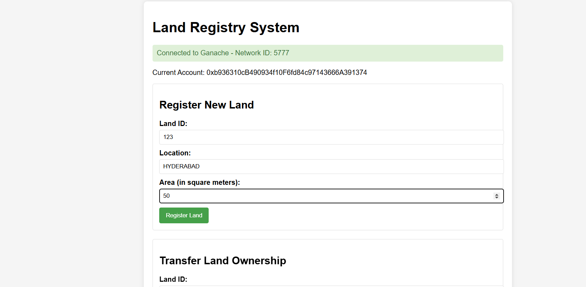
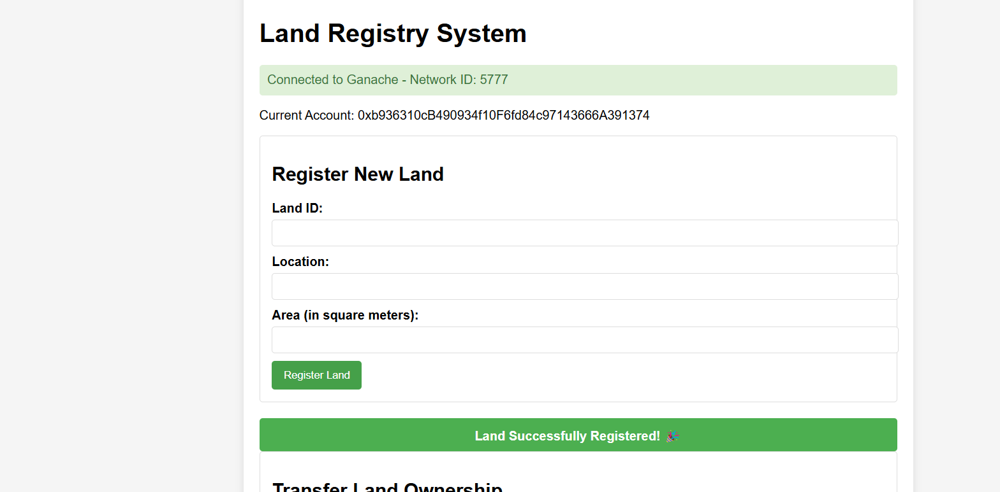
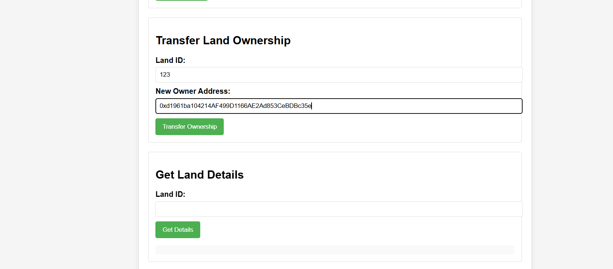
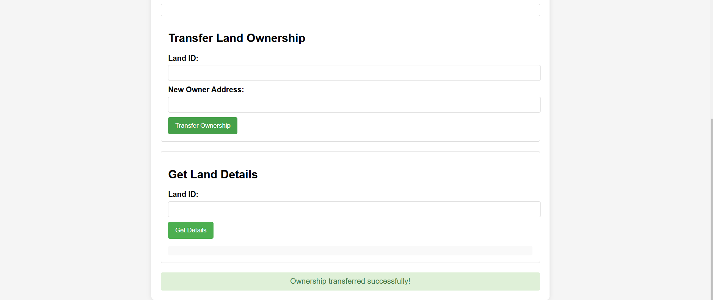
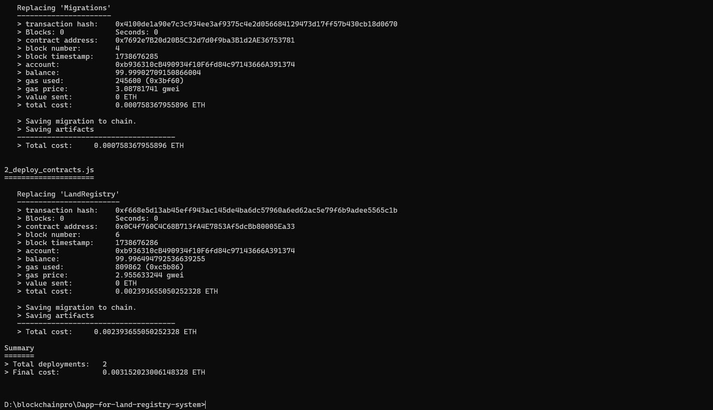

# Land Registry System using Blockchain

## Overview
The **Land Registry System** is a decentralized application (DApp) built using **Blockchain** technology to securely and transparently maintain the ownership and transfer of land records. This system utilizes blockchain's immutability to eliminate the need for intermediaries and reduce fraud in land transactions.

## Features
- **Secure Ownership Tracking**: Land ownership records are stored on the blockchain, ensuring that they cannot be altered or tampered with.
- **Immutable Records**: Once a record is added to the blockchain, it is permanent, offering a verifiable record of land ownership.
- **Efficient Transactions**: Buyers and sellers can conduct land transactions securely without relying on centralized authorities.
- **Smart Contracts**: Smart contracts automatically enforce the terms of land transactions, ensuring both parties meet their obligations.
- **Decentralized and Transparent**: All transactions are transparent and visible to all network participants, promoting trust and fairness.

## Screenshots

## Usage

- **Land Registration**: Users can register land properties by submitting details such as location, area, and ownership.
- **Ownership Transfer**: Buyers and sellers can transfer ownership of land by making transactions that are confirmed by smart contracts.
- **Search Land Records**: Users can search land records by a unique identifier such as land ID.

## Tech Stack
- **Blockchain**: Ethereum (using Solidity for smart contract development)
- **Smart Contracts**: Written in Solidity
- **Backend**: Truffle framework (for smart contract management)
- **Frontend**: HTML, CSS, JavaScript ,(interacting with the blockchain via **Web3.js**)

## Installation

### Prerequisites
1. Install [Node.js](https://nodejs.org/), which is required to manage the project's dependencies.
2. Install [Truffle](https://www.trufflesuite.com/truffle), a framework for smart contract development.
3. Install [Ganache](https://www.trufflesuite.com/ganache), a personal blockchain for Ethereum development.

### Steps to Run the Project
1. Clone the repository to your local machine.
2. Navigate into the project folder.
3. Install all necessary dependencies using Node.js and npm (Node Package Manager).
4. Start Ganache to run a local Ethereum blockchain for testing.
5. Compile the smart contracts to prepare them for deployment.
6. Migrate the smart contracts to the local Ethereum blockchain using Truffle.
7. Launch the frontend by opening the project in any HTTP server (like the Live Server extension in Visual Studio Code or another local server).

